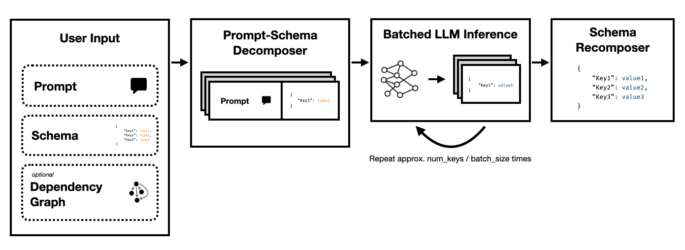

# Super JSON Mode: A Framework for Accelerated Structured Output Generation



**Super JSON Mode** is a Python framework that enables the efficient creation of structured output from an LLM by breaking up a target schema into atomic components and then performing generations in parallel.

It supports both state of the art LLMs via **OpenAI**'s legacy completions API and open source LLMs such as via **Hugging Face Transformers** and **vLLM**. More LLMs will be supported soon!

Compared to a naive JSON generation pipeline relying on prompting and HF Transformers, we find Super JSON Mode can generate outputs as much as **10x faster**. It's also more deterministic and less likely to run into parsing issues when compared to naive generation.

Installation is simple: `pip install super-json-mode`

## How does it work?

Structured output formats, such as JSON or YAML, have an inherent parallel or hierarchichal structure.

Consider the following unstructured passage (generated by GPT-4):

> Welcome to 123 Azure Lane, a stunning San Francisco residence boasting fantastic contemporary design, now on the market for $2,500,000. Spread out over a luxurious 3,000 square feet, this property combines sophistication and comfort to create a truly unique living experience.

> An idyllic home for families or professionals, our exclusive residence is equipped with five spacious bedrooms, each oozing warmth and modern elegance. The bedrooms are carefully planned to allow ample natural light and generous storage space. With three elegantly designed full bathrooms, the residence guarantees convenience and privacy for its residents.

> The grand entrance leads you to a spacious living area, providing an excellent ambience for gatherings or a quiet evening by the fire. The chef's kitchen includes state-of-the-art appliances, custom cabinetry, and beautiful granite countertops making it a dream for anyone who loves to cook.

If we want to extract `address`, `square footage`, `number of bedrooms`, `number of bathrooms`, and `price` using an LLM, we could ask the model to fill in a schema according to the description.

A potential schema (such as one generated from a Pydantic object) could look like this:

```
{
    "address": {
        "type": "string"
    },
    "price": {
        "type": "number"
    },
    "square_feet": {
        "type": "integer"
    },
    "num_beds": {
        "type": "integer"
    },
    "num_baths": {
        "type": "integer"
    }
}
```

And a valid output could look something like this:

```
{
  "address": "123 Azure Lane",
  "price": 2500000,
  "square_feet": 3000,
  "num_beds": 5,
  "num_baths": 3
}
```

The obvious approach is to nest the schema in the prompt and ask the model to fill it in. This is currently how most teams currently extract structured output from unstructured text using LLMs.

However, this is inefficient for three reasons.

1. Notice how each of these keys are independent of one another. Super JSON Mode takes advantage of **prompt parallelism** by treating every key-value pair in the schema as a separate inquiry. For example, we can extract the `num_baths` without having already generated the `address`!

2. Requesting a model to generate JSON from scratch unnecessarily consumes tokens (and therfore time) on predictable syntax, like braces and keys names, which are already expected in the output. This is a strong prior on the generation that we should be able to use to improve latencies.

3. LLMs are embarrasingly parallel and running queries in batches is much faster than in a serial order. Thus, we can split up the schema over multiple queries. The LLM will then fill in the schema for each independent key **in parallel** and emit far fewer tokens in a single pass, allowing for much faster inference times.

## Installation

### Via PyPI

Run the following command:

```
pip install super-json-mode
```

### Manual

1. Create a conda environment

```
conda create --name superjsonmode python=3.10 -y
conda activate superjsonmode
```

2. Clone and install the dependencies

```
git clone https://github.com/varunshenoy/super-json-mode
cd superjsonmode
pip install -r requirements.txt
```

## Examples

We've tried to make Super JSON Mode super easy to use. See the `examples` folder for more examples and `vLLM` usage.

Using OpenAI and `gpt-3-instruct-turbo`:

```python
from superjsonmode.integrations.openai import StructuredOpenAIModel
from pydantic import BaseModel
import time

model = StructuredOpenAIModel()

class Character(BaseModel):
    name: str
    genre: str
    age: int
    race: str
    occupation: str
    best_friend: str
    home_planet: str

prompt_template = """{prompt}

Please fill in the following information about this character for this key. Keep it succinct. It should be a {type}.

{key}: """


prompt = """Luke Skywalker is a famous character."""

start = time.time()
output = model.generate(
    prompt,
    extraction_prompt_template=prompt_template,
    schema=Character,
    batch_size=7,
    stop=["\n\n"],
    temperature=0,
)

print(f"Total time: {time.time() - start}")
# Total Time: 0.409s

print(output)
# {
#     "name": "Luke Skywalker",
#     "genre": "Science fiction",
#     "age": "23",
#     "race": "Human",
#     "occupation": "Jedi Knight",
#     "best_friend": "Han Solo",
#     "home_planet": "Tatooine",
# }
```

Using Mistral 7B with HuggingFace Transformers:

```python
from transformers import AutoTokenizer, AutoModelForCausalLM
from superjsonmode.integrations.transformers import StructuredOutputForModel
from pydantic import BaseModel

device = "cuda"
model = AutoModelForCausalLM.from_pretrained("mistralai/Mistral-7B-Instruct-v0.2").to(device)
tokenizer = AutoTokenizer.from_pretrained("mistralai/Mistral-7B-Instruct-v0.2")

# Create a structured output object
structured_model = StructuredOutputForModel(model, tokenizer)

passage = """..."""

class QuarterlyReport(BaseModel):
    company: str
    stock_ticker: str
    date: str
    reported_revenue: str
    dividend: str

prompt_template = """[INST]{prompt}

Based on this excerpt, extract the correct value for "{key}". Keep it succinct. It should have a type of `{type}`.[/INST]

{key}: """

output = structured_model.generate(passage,
                                   extraction_prompt_template=prompt_template,
                                   schema=QuarterlyReport,
                                   batch_size=6)

print(json.dumps(output, indent=2))

# {
#   "company": "NVIDIA",
#   "stock_ticker": "NVDA",
#   "date": "2023-10",
#   "reported_revenue": "18.12 billion dollars",
#   "dividend": "0.04"
# }

```

## Roadmap

There's a lot of features that can make Super JSON Mode better. Here are some ideas.

- [ ] **Qualitative output analysis**: We ran performance benchmarks, but we should come up with a more rigorous approach to judging the qualitative outputs of Super JSON Mode.

- [ ] **Structured sampling**: ideally, we should mask the LLM's logits to enforce type constraints, similar to JSONFormer. There are a few packages out there that already do this, and either those should integrate our parallelized JSON generation pipeline or we should build it out into Super JSON Mode.

- [ ] **Dependency graph support**: Super JSON Mode has a very obvious failure case: when a key has a dependency on another key. Consider a JSON blob with two keys, `thought` and `response`. This sort of desired output is common for chain-of-thought with large language models, and it's very clear that the `response` is dependent on the `thought`. We should be able to pass in a graph of dependencies and batch prompts in a way that parent outputs are completed and passed onto child schema items.

- [ ] **Local Model Support**: Super JSON Mode works best in local situations where batch size is generally 1. You can exploit batching to reduce latency, similar to speculative decoding. Llama.cpp is the premier framework for local models + cpu inference. I'd love to implement this using Ollama if possible.

- [ ] **TRT-LLM support**: vLLM is great and easy to use, but ideally we integrate with a much more performant framework like TRT-LLM.

## Citation

We appreciate it if you would please cite this repo if you found the library useful for your work:

```
@misc{ShenoyDerhacobian2024,
  author = {Shenoy, Varun and Derhacobian, Alex},
  title = {Super JSON Mode: A Framework for Accelerated Structured Output Generation},
  year = {2024},
  publisher = {GitHub},
  journal = {GitHub repository},
  howpublished = {\url{https://github.com/varunshenoy/super-json-mode}}
}
```

_This project was built for CS 229: Systems for Machine Learning. Huge thanks to the teaching team and TAs for their guidance throughout this project._
